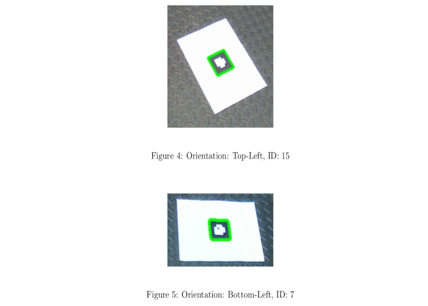
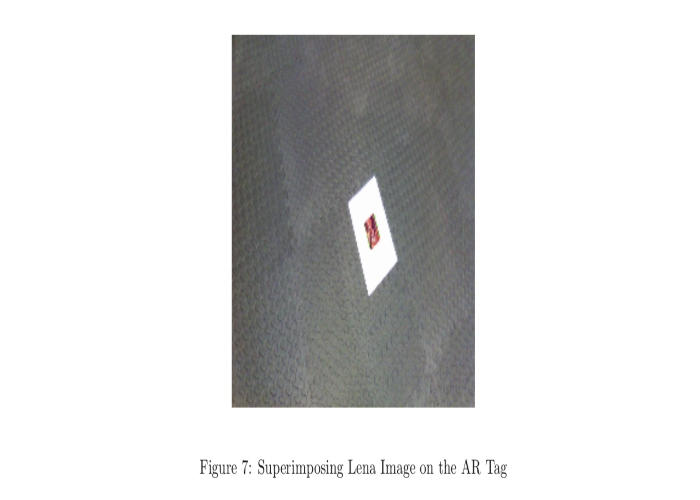

# AR-Tag Detection and Tracking using Homography


### Authors
Arpit Aggarwal
Shantam Bajpai


### Introduction to the Project
The project was divided in three phases as explained below:<br>
1. The first task was detecting the AR-Tag corners and then using the homography concept to find the AR-Tag ID and its orientation.<br>
2. The second task was superimposing an image on the AR-Tag.<br> 
3. The third task was superimposing a 3D object on the AR-Tag.


### Software Required
To run the .py files, use Python 3. Standard Python 3 libraries like OpenCV, Numpy, Scipy and matplotlib are used.


### Example of finding the orientation of the AR-Tag using Homography



### Example of projecting Lena image on the AR-Tag using Homography



### Instructions for running the code
To run the code for problem 1, follow the following commands:

```
cd Code
python problem1.py 'video_path(in .mp4 format)'
```
where, video_path is the path for input video. For example, running the python file on my local setup was:

```
cd Code/
python problem1.py ../data/Tag0.mp4
```


To run the code for problem 2a, follow the following commands:

```
cd Code/
python problem2a.py 'video_path(in .mp4 format)' 'output_video_path(in .avi format)' 'lena_path'
```
where, video_path, output_video_path and lena_path are the paths for input video, output video and lena image respectively. For example, running the python file on my local setup was:

```
cd Code/
python problem2a.py ../data/Tag0.mp4 ../data/lena_tag0.avi ../data/Lena.png
```


To run the code for problem 2b, follow the following commands:

```
cd Code/
python problem2b.py 'video_path(in .mp4 format)'
```
where, video_path is the path for the input video. For example, running the python file on my local setup was:

```
cd Code/
python problem2b.py ../data/Tag0.mp4
```


### Video File Output Links
Problem 1:
Output for Tag0.mp4: 
https://drive.google.com/file/d/11YO94wywqBKN62c0E65OJwXRgwI1eZ_Y/view?usp=sharing

Problem 2a:
Output for Tag0.mp4: 
https://drive.google.com/file/d/1nrU5DAQNK8B4u_3m6UVGBilAHh0UDNV_/view?usp=sharing

Problem 2b:
Output for Tag0.mp4: 
https://drive.google.com/file/d/1dRk6aS0kljCm1NHKR-4Z2OXBVUpUPnLC/view?usp=sharing


### Credits
The following links were helpful for this project:
1. https://www.pyimagesearch.com/2016/03/21/ordering-coordinates-clockwise-with-python-and-opencv/
2. https://www.pyimagesearch.com/2014/05/05/building-pokedex-python-opencv-perspective-warping-step-5-6/
3. https://www.learnopencv.com/image-alignment-feature-based-using-opencv-c-python/
4. https://www.learnopencv.com/tag/projection-matrix/
